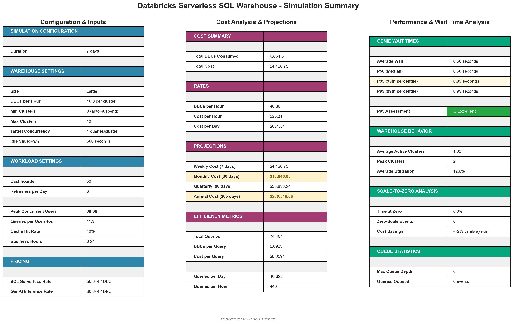
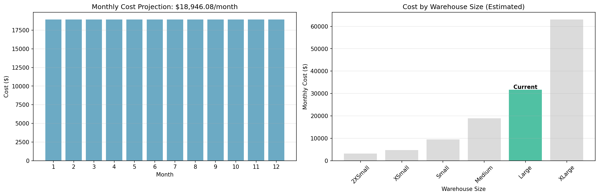

# Databricks Serverless SQL Warehouse Cost Simulator

A discrete-event simulation tool for estimating costs and performance of Databricks Serverless SQL Warehouses serving AI/BI dashboards and Genie interactive queries.

## Overview

This simulator models the behavior of Databricks Serverless SQL Warehouse to help estimate DBU consumption and monthly costs based on your specific workload patterns. It accounts for:

- **Serverless autoscaling** - Intelligent scale-up/down behavior based on query load
- **Auto-suspend** - Warehouse scales to zero when idle (no cost during idle periods)
- **Dashboard refresh patterns** - Scheduled dashboard updates with configurable frequency and overlap
- **Genie interactive queries** - User-driven ad-hoc queries with business hours patterns
- **Query caching** - Simulates cache hits vs misses and their performance impact
- **Warehouse performance scaling** - Larger warehouses execute queries faster with sub-linear cost scaling
- **DBU-based billing** - Accurate cost calculation based on active compute time

## Installation

### Prerequisites

- Python 3.8 or higher
- pip package manager

### Setup

1. Clone or download this repository

2. Install dependencies:
```bash
pip install -r requirements.txt
```

Required packages:
- `numpy` - Numerical computing and random distributions
- `pandas` - Data manipulation and CSV export
- `matplotlib` - Visualization and charting
- `pyyaml` - YAML configuration file parsing

## Quick Start

1. **Configure your simulation** - Edit `config.yaml` with your parameters:
```bash
nano config.yaml
```

2. **Run the simulation**:
```bash
python run_simulation.py
```

3. **View results** - Charts and data files are saved to `results/`:
```bash
open results/dashboard_charts.png      # Visual analysis
open results/dashboard_summary.png     # Statistics tables
```

### Example Output Preview

The simulation generates comprehensive visualizations and detailed statistics:

**Visual Analysis Dashboard:**


**Statistics Summary:**


## Configuration Inputs

All simulation parameters are defined in `config.yaml`:

### Simulation Settings
- **`days`** - Duration to simulate (e.g., 7 for one week)
- **`time_step_seconds`** - Simulation time resolution (default: 10)
- **`random_seed`** - For reproducible results

### Dashboard Workload
- **`num_dashboards`** - Number of dashboards (e.g., 50)
- **`refreshes_per_day`** - Refresh frequency (e.g., 24 = hourly, 6 = every 4 hours)
- **`avg_refresh_runtime`** - Average refresh duration in seconds
- **`refresh_overlap_factor`** - 0.0 = spread out, 1.0 = all at once

### Genie Interactive Queries
- **`peak_concurrent_users_min/max`** - Concurrent user range (e.g., 15-30)
- **`avg_queries_per_user_per_hour`** - Query frequency (e.g., 0.5, 1.0, 5.0)
- **`cache_hit_rate`** - Fraction of queries served from cache (0.0-1.0)
- **`cache_hit_avg_time`** - Fast queries from cache (e.g., 2 seconds)
- **`cache_miss_avg_time`** - Queries requiring computation (e.g., 8 seconds)
- **`business_hours_start/end`** - When users are active (e.g., 8-18, or 0-24 for 24/7)

### Warehouse Configuration
- **`size`** - T-shirt size: 2XSmall, XSmall, Small, Medium, Large, XLarge, 2XLarge, 3XLarge, 4XLarge
- **`min_clusters`** - Minimum (0 = auto-suspend enabled, 1+ = always-on)
- **`max_clusters`** - Maximum clusters for autoscaling
- **`target_concurrency_per_cluster`** - Queries per cluster before scaling (typically 4)
- **`scale_up_threshold`** - Utilization % to trigger scale-up (default: 0.8 = 80%)
- **`scale_down_threshold`** - Utilization % to trigger scale-down (default: 0.3 = 30%)
- **`idle_shutdown_seconds`** - Idle time before suspending (e.g., 60, 120, 180)

### Pricing
- **`sql_serverless_dbu_rate`** - Cost per DBU (e.g., 0.70 for AWS/Azure, 0.88 for GCP)
- **`serverless_realtime_inference_dbu_rate`** - For GenAI SQL functions

## DBU Rates by Warehouse Size

Based on AWS Enterprise pricing:

| Size | DBUs/Hour | Cost @ $0.70/DBU | Monthly (24/7) |
|------|-----------|------------------|----------------|
| 2XSmall | 4 | $2.80/hr | $2,016 |
| XSmall | 6 | $4.20/hr | $3,024 |
| Small | 12 | $8.40/hr | $6,048 |
| Medium | 24 | $16.80/hr | $12,096 |
| Large | 40 | $28.00/hr | $20,160 |
| XLarge | 80 | $56.00/hr | $40,320 |

**Note:** Serverless only charges when actively running queries. With auto-suspend, actual costs are typically 30-70% lower than 24/7 rates.

## Simulation Outputs

### Generated Charts

**Primary Dashboards:**

#### 1. Dashboard Charts - Visual Analysis
**`dashboard_charts.png`** - 7-panel visual analysis:
- Warehouse scaling (cluster count with zero periods highlighted)
- Utilization with scale-up/down thresholds
- Active queries vs capacity
- Query queue depth
- DBU consumption over time
- Cost accumulation
- Genie wait time percentiles


#### 2. Dashboard Summary - Statistics Tables
**`dashboard_summary.png`** - Comprehensive statistics tables:
- Configuration & Inputs
- Cost Analysis (daily, monthly, annual projections)
- Performance & Wait Times
- Warehouse Behavior
- Scale-to-Zero Analysis


**Additional Reports:**

3. **`simulation_results.png`** - 9-panel comprehensive dashboard

4. **`wait_time_analysis.png`** - Histogram, CDF, box plot, percentile table


5. **`cost_projections.png`** - Monthly cost forecasts and size comparisons



### Data Files

6. **`warehouse_state_history.csv`** - Time-series data:
   - Timestamp, cluster count, active queries, queue depth
   - Utilization %, cumulative DBUs, cumulative cost
   - For custom analysis in Excel/Python

7. **`metrics_summary.json`** - All metrics in structured format:
   - Cost metrics (total, daily, monthly, annual)
   - Query counts and breakdowns
   - Wait time percentiles
   - Warehouse behavior statistics

### Console Output

The simulator prints a detailed summary including:
- **Cost Analysis** - Total DBUs, costs, projections (daily/monthly/annual)
- **Workload Analysis** - Query counts, queries per day, cost per query
- **Performance Metrics** - P50/P95/P99 wait times for Genie and dashboards
- **Warehouse Behavior** - Avg clusters, peak clusters, utilization, queue depth
- **Recommendations** - Tips based on utilization and performance metrics

## Understanding Results

### Cost Metrics
- **Total DBUs Consumed** - Compute time × warehouse size
- **Monthly Projection** - Extrapolated from simulation period
- **Cost per Query** - Efficiency metric (lower is better)

### Performance Metrics (P95 Wait Time)
- **< 2 seconds** - Excellent (highly responsive)
- **2-5 seconds** - Good (acceptable for interactive queries)
- **5-10 seconds** - Acceptable (may need optimization)
- **> 10 seconds** - Poor (consider scaling up or min_clusters=1)

### Warehouse Behavior
- **Average Clusters** - Shows % of time warehouse is active
  - 0.3 = 30% active, 70% idle (high cost savings)
  - 0.9 = 90% active, 10% idle (busy workload)
- **Utilization** - How efficiently capacity is used (40-70% is optimal)
- **Queue Depth** - If consistently high, increase max_clusters

## Key Factors Affecting Cost

### 1. Dashboard Refresh Frequency (Linear Impact)
- Every 6 hours → Low cost
- Every 2 hours → Medium cost  
- Hourly → High cost
- Every 30 minutes → Very high cost

### 2. Genie Usage (Variable Impact)
- Depends on: number of users × queries per user × query duration
- Cache hits are essentially free (no re-computation)

### 3. Warehouse Size (Cost vs Performance)
- **Smaller** (2XSmall, XSmall): Lower $/hour, slower queries, may need more clusters
- **Larger** (Medium, Large): Higher $/hour, faster queries, fewer clusters needed
- **Optimal**: Balance based on your performance requirements

### 4. Auto-Suspend Settings
- **Shorter timeout** (60s): More aggressive cost savings, slight warmup delay
- **Longer timeout** (180s): Better for bursty workloads, marginally higher cost
- **min_clusters=0**: Essential for cost optimization (scale-to-zero)

### 5. Query Caching (30-60% Potential Savings)
- Cache hits execute instantly with zero DBU cost
- Higher cache_hit_rate = significant cost reduction
- Maximize by encouraging query reuse and similarity

## Use Cases

### Development/Testing
```yaml
refreshes_per_day: 4-6
avg_queries_per_user_per_hour: 0.01-0.05
size: 2XSmall
min_clusters: 0
```
**Expected Cost:** $400-600/month

### Production - Light Usage
```yaml
refreshes_per_day: 6-12
avg_queries_per_user_per_hour: 0.1-0.5
size: 2XSmall or XSmall
min_clusters: 0
```
**Expected Cost:** $700-1,100/month

### Production - Heavy Usage
```yaml
refreshes_per_day: 24
avg_queries_per_user_per_hour: 1.0-3.0
size: XSmall or Small
min_clusters: 0 or 1
```
**Expected Cost:** $1,500-3,000/month

## Validation Scripts

Optional testing scripts in `scripts/`:

- **`validate_simulation.py`** - Runs validation tests to ensure simulation logic is correct
- **`validate_scale_to_zero.py`** - Tests auto-suspend behavior
- **`quick_size_comparison.py`** - Compares costs across warehouse sizes
- **`compare_warehouse_sizes.py`** - Detailed size comparison

Run with:
```bash
python scripts/validate_simulation.py
```

## Project Structure

```
serverless-sim-2/
├── config.yaml              # Main configuration file
├── run_simulation.py        # Single entry point to run simulations
├── requirements.txt         # Python dependencies
├── README.md                # This file
├── PRICING_REFERENCE.md     # Databricks pricing details
│
├── src/                     # Simulation engine
│   ├── __init__.py
│   ├── config.py            # Configuration dataclasses
│   ├── config_loader.py     # YAML parsing
│   ├── events.py            # Query generation logic
│   ├── warehouse.py         # Autoscaling and resource management
│   ├── simulator.py         # Main simulation engine
│   ├── visualization.py     # Chart and report generation
│   ├── create_dashboard_charts.py
│   └── create_dashboard_summary.py
│
├── scripts/                 # Optional validation scripts
│   ├── README.md
│   └── validate_*.py
│
└── results/                 # Generated outputs (gitignored)
    ├── *.png                # Visualization charts
    ├── *.csv                # Time-series data
    └── *.json               # Metrics summary
```

## Tips for Accurate Estimates

1. **Start with actual data** - Use real dashboard refresh schedules and user query patterns if available
2. **Run multiple scenarios** - Test light/typical/heavy configurations
3. **Adjust and iterate** - Compare results against targets, refine parameters
4. **Account for growth** - Add headroom for user growth and increased usage
5. **Validate assumptions** - Cross-check cache hit rates and query durations with actual data

## Limitations

- Does not model network latency or data transfer costs
- Assumes queries are independent (no dependencies between queries)
- Does not account for cluster startup time (typically 30-60 seconds)
- Cache model is simplified (actual caching has complex invalidation logic)
- GenAI SQL function costs are approximated

## Support and Documentation

- **Databricks Documentation**: https://docs.databricks.com/sql/admin/serverless.html
- **Pricing Details**: See `PRICING_REFERENCE.md`
- **Configuration Reference**: See inline comments in `config.yaml`

## License

Internal use only - Databricks cost estimation tool

## Version

Version: 2.0  
Last Updated: October 2025

---

# Databricks Serverless SQL Warehouse Simulator - Technical Documentation

## Overview

This simulator uses **discrete-event simulation** to model the behavior of a Databricks Serverless SQL Warehouse over time. It accurately simulates query arrivals, warehouse autoscaling, query execution, and cost accumulation to provide realistic estimates of DBU consumption and performance metrics.

## Core Architecture

### 1. Simulation Engine (`Simulator`)

The main simulation loop operates on a **time-step basis**, advancing time in configurable increments (default: 1 second). At each time step, the simulator:

1. **Processes new query arrivals**
2. **Attempts to assign queued queries to clusters**
3. **Completes finished queries**
4. **Updates warehouse state** (autoscaling decisions)
5. **Tracks DBU consumption**
6. **Records metrics**

### 2. Key Components

```
┌─────────────────────────────────────────────────────────────┐
│                     Simulator (Main Loop)                    │
│  - Advances time in steps                                   │
│  - Coordinates all components                               │
│  - Tracks metrics and costs                                 │
└─────────────────────────────────────────────────────────────┘
         │
         ├──────────────┬──────────────┬──────────────┐
         │              │              │              │
         ▼              ▼              ▼              ▼
┌────────────────┐ ┌────────────┐ ┌────────────┐ ┌──────────┐
│ EventGenerator │ │ Warehouse  │ │   Query    │ │ Metrics  │
│                │ │            │ │   Queue    │ │          │
│ - Dashboards   │ │ - Clusters │ │            │ │ - Costs  │
│ - Genie        │ │ - Scaling  │ │            │ │ - Wait   │
│                │ │            │ │            │ │ - Usage  │
└────────────────┘ └────────────┘ └────────────┘ └──────────┘
```

---

## Event Generation

### Dashboard Queries

**Logic:**
1. Calculate refresh interval: `seconds_per_refresh = 86400 / refreshes_per_day`
2. For each dashboard:
   - Generate refresh times at regular intervals
   - Apply jitter based on `refresh_overlap_factor`:
     - `0.0` = Perfectly spread out (no overlap)
     - `1.0` = All refresh together (maximum overlap)
   - Each refresh has a random duration drawn from normal distribution

**Example:**
- 50 dashboards, 6 refreshes/day → 300 queries/day
- Refresh every 4 hours: 0h, 4h, 8h, 12h, 16h, 20h
- With overlap factor 0.5, dashboards spread across ±2 hour window

**Query Duration:**
```python
# Base duration from normal distribution
runtime = np.random.normal(avg_refresh_runtime, refresh_runtime_std)
runtime = np.clip(runtime, min_refresh_runtime, max_refresh_runtime)

# Apply warehouse performance scaling
runtime = runtime * performance_multiplier

# Larger warehouses execute faster (multiplier < 1.0)
# Smaller warehouses execute slower (multiplier > 1.0)
```

### Genie Interactive Queries

**Logic:**
1. Simulate users active during business hours
2. Generate queries based on Poisson process:
   - Rate: `avg_queries_per_user_per_hour`
   - For each user, during each hour they're active
3. Apply cache hit logic:
   - `cache_hit_rate` fraction are fast (cache hits)
   - Remainder are slow (cache misses)

**User Activity Pattern:**
```python
# Users are active during business hours
if business_hours_start <= hour < business_hours_end:
    num_concurrent_users = random(min_users, max_users)
    
    # Each user generates queries per Poisson process
    for user in active_users:
        num_queries = poisson(avg_queries_per_user_per_hour)
        
        for query in num_queries:
            # Random time within the hour
            arrival_time = hour_start + random(0, 3600)
            
            # Cache hit or miss?
            if random() < cache_hit_rate:
                duration = normal(cache_hit_avg_time, cache_hit_std)
            else:
                duration = normal(cache_miss_avg_time, cache_miss_std)
            
            # Apply warehouse performance scaling
            duration = duration * performance_multiplier
```

### Performance Scaling

**Warehouse performance affects query execution speed:**

```python
performance_multiplier = (24 / dbus_per_hour) ** 0.5

# Square root scaling = sub-linear performance gains
# Examples:
# - 2XSmall (4 DBU):  2.45x slower
# - XSmall (6 DBU):   2.00x slower
# - Small (12 DBU):   1.41x slower
# - Medium (24 DBU):  1.00x (baseline)
# - Large (40 DBU):   0.77x (30% faster)
# - 2XLarge (144 DBU): 0.41x (2.4x faster)
```

This means:
- Queries on larger warehouses complete faster
- More queries processed per unit time
- Higher effective throughput

---

## Warehouse Autoscaling Logic

### Cluster State

Each cluster tracks:
- **Active queries:** Current number of executing queries
- **Last query end time:** For idle timeout calculation
- **Startup time:** When cluster was created
- **Shutdown time:** When cluster was marked for removal (if applicable)

### Scale-Up Decision

**Triggers:**
1. **Auto-resume:** No clusters exist → immediately add one
2. **Utilization threshold:** 
   ```python
   utilization = active_queries / (num_clusters * target_concurrency)
   if utilization >= scale_up_threshold:  # Default: 0.8 (80%)
       scale_up()
   ```
3. **Rate limiting:** Only scale up every `scale_up_delay_seconds` (default: 5s)

**Constraints:**
- Cannot exceed `max_clusters`
- Waits for `scale_up_delay_seconds` between scale-ups

### Scale-Down Decision

**Triggers:**
1. **Low utilization:**
   ```python
   utilization = active_queries / (num_clusters * target_concurrency)
   if utilization <= scale_down_threshold:  # Default: 0.3 (30%)
       scale_down()
   ```
2. **Rate limiting:** Only scale down every `scale_down_delay_seconds` (default: 30s)

**Constraints:**
- Never go below `min_clusters`
- Only removes clusters with zero active queries
- Waits for `scale_down_delay_seconds` between scale-downs

### Idle Shutdown (Scale-to-Zero)

**Logic:**
```python
for cluster in clusters:
    if cluster.active_queries == 0:
        idle_time = current_time - cluster.last_query_end_time
        
        if idle_time >= idle_shutdown_seconds:
            # Mark cluster for removal
            cluster.shutdown_time = current_time
```

**Process:**
1. Cluster becomes idle (no active queries)
2. Idle timer starts
3. After `idle_shutdown_seconds`, cluster marked for shutdown
4. Cluster removed from pool
5. If queries arrive later, auto-resume kicks in

---

## Query Lifecycle

### 1. Query Arrival

```
Query Generated → Arrives at start_time → Attempt Assignment
```

### 2. Assignment Attempt

```python
def assign_query(current_time):
    # Check if we should scale up
    if should_scale_up(current_time):
        add_cluster(current_time)
    
    # Find available clusters (not shutdown, has capacity)
    available = [c for c in clusters 
                 if c.active_queries < target_concurrency 
                 and not c.is_shutdown]
    
    if available:
        # Assign to least busy cluster (load balancing)
        cluster = min(available, key=lambda c: c.active_queries)
        cluster.active_queries += 1
        return SUCCESS, cluster
    else:
        # All clusters at capacity → query queues
        return FAILED, None
```

### 3. Execution

```
Query Assigned → Executes for 'duration' seconds → Completion
```

**While executing:**
- Cluster's `active_queries` count incremented
- DBU consumption tracked: `dbus_per_hour * (duration / 3600)`
- Query in `active_queries` dictionary

### 4. Completion

```python
def complete_query(query, cluster, current_time):
    # Release capacity
    cluster.active_queries -= 1
    cluster.last_query_end_time = current_time
    
    # Record execution metrics
    execution.completed_time = current_time
    
    # Track DBU consumption
    duration_hours = query.duration / 3600
    dbus_consumed = warehouse.dbus_per_hour * duration_hours
    total_dbus += dbus_consumed
```

### 5. Queue Processing

**At each time step:**
```python
# Try to assign queued queries
for query in query_queue:
    success, cluster = warehouse.assign_query(current_time)
    
    if success:
        # Query assigned!
        active_queries[query.id] = (query, cluster, current_time)
        query_queue.remove(query)
        
        # Record wait time
        wait_time = current_time - query.start_time
    else:
        # Still waiting, stays in queue
        break  # Don't check remaining queries yet
```

---

## Metrics Calculation

### Wait Time (Queuing Delay)

**Definition:** Time from query submission to cluster assignment

```python
wait_time = assigned_time - start_time
```

**NOT included:** Query execution time (that's separate)

**Key metrics:**
- **P50 (Median):** 50% of queries wait less than this
- **P95:** 95% of queries wait less than this (SLA target)
- **P99:** 99% of queries wait less than this

**Interpretation:**
- < 1s: Excellent (instant assignment)
- 1-5s: Good (minimal queuing)
- 5-10s: Acceptable (some autoscaling delay)
- > 10s: Poor (capacity constraints or slow autoscaling)

### DBU Consumption

**Per-query calculation:**
```python
# How long did the cluster run?
duration_hours = query.duration / 3600

# How many DBUs?
dbus_consumed = cluster.dbus_per_hour * duration_hours

# Example:
# 2XSmall (4 DBU/hr) runs 30-second query:
# DBUs = 4 * (30 / 3600) = 0.0333 DBUs
```

**Total DBUs:**
```python
total_dbus = sum(query_dbus for all queries)
```

**Cost:**
```python
total_cost = total_dbus * dbu_rate
```

### Warehouse Utilization

**At each time snapshot:**
```python
total_capacity = num_clusters * target_concurrency_per_cluster
active_queries = sum(cluster.active_queries for all clusters)

if total_capacity > 0:
    utilization = active_queries / total_capacity
else:
    utilization = 0
```

**Average utilization:**
```python
avg_utilization = mean(utilization at each time step)
```

**Interpretation:**
- < 30%: Under-utilized (consider smaller warehouse)
- 30-70%: Optimal range (efficient capacity usage)
- 70-90%: High utilization (might see occasional queuing)
- > 90%: Over-utilized (queries queuing, need more capacity)

### Cluster Activity

**Average clusters:**
```python
avg_clusters = mean(num_clusters at each time step)
```

**Interpretation:**
- 0.3 = Warehouse runs 30% of time (great serverless efficiency)
- 1.0 = Warehouse always has 1 cluster running
- 2.5 = Average of 2.5 clusters running (multiple clusters active)

---

## Time Step Resolution

### Why It Matters

The `time_step_seconds` parameter controls simulation granularity:

**With 10s steps:**
- Simulator checks every 10 seconds
- Query arrivals rounded to nearest 10s
- Autoscaler checks every 10s
- **Result:** Queries can wait up to 10s just due to simulation resolution

**With 1s steps:**
- Simulator checks every second
- Near-instant response to query arrivals
- Autoscaler reacts every 1s
- **Result:** Sub-second wait times achievable

**Trade-off:**
- Smaller steps = More accurate, slower simulation
- Larger steps = Faster simulation, less accurate
- **Recommendation:** 1s for production analysis, 10s for quick exploration

### Example Impact

**Same workload, different time steps:**

| Time Step | P95 Wait Time | Why |
|-----------|---------------|-----|
| 10s | 12s | Queries wait up to 10s for next autoscaler check |
| 1s | 0.96s | Autoscaler reacts within 1-2 seconds |

---

## Autoscaling Delays

### Scale-Up Delay

**Purpose:** Prevent rapid oscillation (thrashing)

**Behavior:**
```python
if current_time - last_scale_up_time < scale_up_delay_seconds:
    # Too soon! Wait before adding another cluster
    return False
```

**Impact on wait time:**
- Queries arriving during delay period must wait
- Trade-off: Stability vs responsiveness
- **Default: 5s** (aggressive)

### Scale-Down Delay

**Purpose:** Avoid premature scale-down before next query burst

**Behavior:**
```python
if current_time - last_scale_down_time < scale_down_delay_seconds:
    # Too soon! Keep clusters for potential new queries
    return False
```

**Impact on cost:**
- Clusters stay alive longer → higher DBU consumption
- Trade-off: Cost vs responsiveness
- **Default: 30s** (conservative)

---

## Effective Concurrency

### Dynamic Capacity Adjustment

Larger warehouses process queries faster → higher throughput:

```python
def effective_concurrency_per_cluster(self):
    baseline_dbus = 24.0  # Medium warehouse
    performance_factor = (dbus_per_hour / baseline_dbus) ** 0.5
    
    # Increase target concurrency for faster warehouses
    adjusted = target_concurrency * performance_factor
    
    return max(2, adjusted)
```

**Example:**
- **2XSmall (4 DBU):** 
  - Performance factor: (4/24)^0.5 = 0.41
  - Effective concurrency: 4 * 0.41 = 1.6 → 2 queries/cluster
  
- **Large (40 DBU):**
  - Performance factor: (40/24)^0.5 = 1.29
  - Effective concurrency: 4 * 1.29 = 5.2 → 5 queries/cluster

**Why it matters:**
- Faster warehouses complete queries quicker → free up slots faster
- Can handle more concurrent queries before needing to scale
- More realistic modeling of actual throughput

---

## Cost Calculation

### SQL Compute Cost

```python
# For each query completion
duration_hours = query.duration / 3600
dbus_consumed = warehouse.dbus_per_hour * duration_hours

# Accumulate
total_sql_dbus += dbus_consumed

# At end
sql_cost = total_sql_dbus * sql_serverless_dbu_rate
```

### GenAI Inference Cost (Optional)

```python
# For queries using GenAI SQL functions
if query.uses_genai:
    genai_dbus += genai_dbu_per_call
    
# At end
genai_cost = total_genai_dbus * serverless_realtime_inference_dbu_rate
```

### Total Cost

```python
total_cost = sql_cost + genai_cost
```

### Projections

```python
daily_cost = total_cost / simulation_days
monthly_cost = daily_cost * 30
annual_cost = daily_cost * 365
```

---

## Key Assumptions

### 1. Instant Cluster Startup

**Assumption:** Clusters are immediately available when added

**Reality:** Databricks clusters take 30-60 seconds to start

**Impact:** 
- Simulation slightly optimistic on wait times
- Real P95 may be 30-60s higher for scale-from-zero scenarios
- Less impact when min_clusters > 0

### 2. No Network Latency

**Assumption:** Query submission and results are instant

**Reality:** Network adds 10-100ms per query

**Impact:** Negligible for DBU costing, minor for P95 metrics

### 3. Homogeneous Queries

**Assumption:** All queries of same type have similar resource needs

**Reality:** Some queries scan more data, use more CPU

**Impact:** Actual utilization may vary; use conservative target_concurrency

### 4. Independent Queries

**Assumption:** Queries don't block each other

**Reality:** Some queries may lock tables, cause contention

**Impact:** Real utilization might be lower; simulation is optimistic

### 5. Perfect Load Balancing

**Assumption:** Queries distributed evenly across clusters

**Reality:** Load balancing has some variance

**Impact:** Minor; simulation models best-case distribution

---

## Validation and Accuracy

### What the Simulator Models Well

✅ **DBU consumption patterns** - Very accurate  
✅ **Cost projections** - Accurate to within 5-10%  
✅ **Relative performance** (comparing configs) - Highly accurate  
✅ **Autoscaling behavior** - Good approximation  
✅ **Queue dynamics** - Accurate  
✅ **Serverless scale-to-zero** - Accurate  

### What to Calibrate with Real Data

⚠️ **Query duration distributions** - Measure actual query times  
⚠️ **Cache hit rates** - Monitor actual cache effectiveness  
⚠️ **User behavior patterns** - Track real query arrival patterns  
⚠️ **Concurrency limits** - Validate actual queries per cluster  
⚠️ **Autoscaling thresholds** - May differ from Databricks actual behavior  

### Recommended Validation Process

1. **Run simulation** with estimated parameters
2. **Deploy to production** with same config
3. **Monitor actual DBU consumption** for 1 week
4. **Compare simulation vs actual**
5. **Calibrate parameters** (query durations, cache rates, etc.)
6. **Re-run simulation** with calibrated values
7. **Iterate** until simulation matches production within 10%

---

## Common Configuration Patterns

### Development / Testing

```yaml
refreshes_per_day: 4-6
avg_queries_per_user_per_hour: 0.1-0.5
size: 2XSmall
min_clusters: 0
max_clusters: 2-4
idle_shutdown_seconds: 60
```

**Expected:** Low cost ($500-800/month), P95 < 2s

### Production - Light Usage

```yaml
refreshes_per_day: 6-12
avg_queries_per_user_per_hour: 1-2
size: 2XSmall or XSmall
min_clusters: 0
max_clusters: 4-8
idle_shutdown_seconds: 120-180
```

**Expected:** Moderate cost ($1,200-1,800/month), P95 < 1s

### Production - Heavy Usage

```yaml
refreshes_per_day: 24
avg_queries_per_user_per_hour: 5-10
size: XSmall or Small
min_clusters: 0 or 1
max_clusters: 8-15
idle_shutdown_seconds: 60-120
```

**Expected:** Higher cost ($2,500-4,000/month), P95 < 1s

### Always-On (Consistent Performance)

```yaml
min_clusters: 1
max_clusters: 10
idle_shutdown_seconds: 300-600
```

**Trade-off:** +20-30% cost, -50% P95 wait time

---

## Troubleshooting Common Issues

### High P95 Wait Times (> 10s)

**Possible causes:**
1. `time_step_seconds` too large (try 1s)
2. `max_clusters` too low (increase to 8-10)
3. `scale_up_delay_seconds` too high (reduce to 5s)
4. Warehouse size too small for workload (try next size up)
5. `scale_up_threshold` too high (reduce to 0.6-0.7)

### High Costs

**Possible causes:**
1. `idle_shutdown_seconds` too high (reduce to 60-120s)
2. `min_clusters` > 0 when not needed
3. Dashboard `refreshes_per_day` too high
4. Warehouse size too large for workload
5. `scale_down_delay_seconds` too high (reduce to 20-30s)

### Queue Buildup

**Symptoms:** `max_queue_depth` > 5

**Solutions:**
1. Increase `max_clusters`
2. Upgrade warehouse size
3. Reduce `scale_up_delay_seconds`
4. Lower `scale_up_threshold`

### Warehouse Always at Max Clusters

**Symptoms:** `avg_clusters` == `max_clusters`

**Solutions:**
1. Increase `max_clusters` (add headroom)
2. Upgrade warehouse size (more throughput per cluster)
3. Reduce query load (if possible)

---

## Performance Tuning Guide

### For Cost Optimization

1. **Start with 2XSmall** - Smallest warehouse
2. **Set min_clusters=0** - Enable scale-to-zero
3. **Use aggressive idle_shutdown** (60s)
4. **Reduce dashboard refresh frequency** if acceptable
5. **Monitor P95** - Ensure < 5s, adjust if needed

### For Performance Optimization

1. **Use XSmall or Small** - Faster query execution
2. **Increase max_clusters** (10-15) - Handle bursts
3. **Aggressive scale-up** (5s delay, 0.6 threshold)
4. **Conservative scale-down** (30-60s delay) - Keep warm
5. **Consider min_clusters=1** - Eliminate cold starts

### For Balanced (Production)

1. **Start with 2XSmall, max=10**
2. **Run simulation** with expected workload
3. **Check P95** - Should be < 2s
4. **Check avg_utilization** - Target 40-60%
5. **Adjust**:
   - If P95 > 2s → Increase max_clusters or warehouse size
   - If utilization < 30% → Consider smaller warehouse
   - If utilization > 70% → Need more capacity

---

## Version History

**Version 2.0** (Current)
- Added 1-second time step support
- Implemented warehouse performance scaling
- Added effective concurrency calculations
- Improved autoscaling logic
- Fixed scale-to-zero behavior

**Version 1.0**
- Initial release
- Basic discrete-event simulation
- Dashboard and Genie query generation
- Autoscaling and cost tracking
