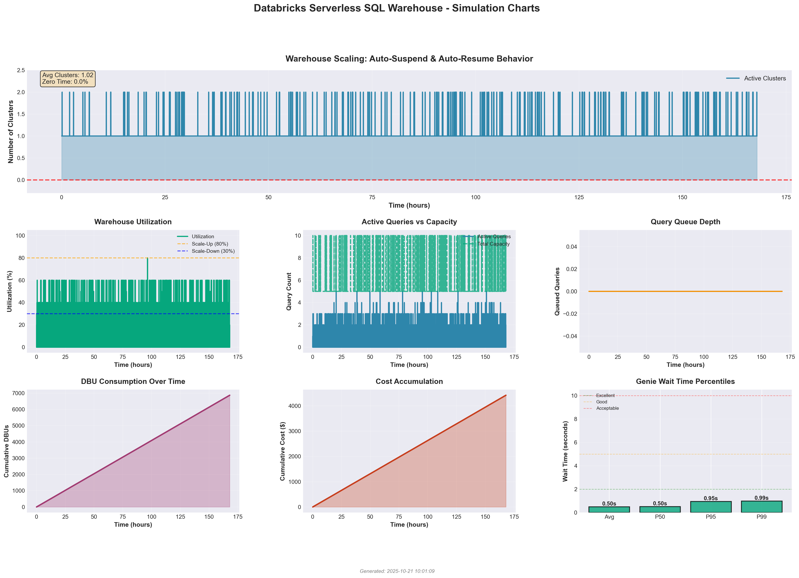

# Databricks Serverless SQL Warehouse Cost Simulator

A discrete-event simulation tool for estimating costs and performance of Databricks Serverless SQL Warehouses serving AI/BI dashboards and Genie interactive queries.

## Overview

This simulator models the behavior of Databricks Serverless SQL Warehouse to help estimate DBU consumption and monthly costs based on your specific workload patterns. It accounts for:

- **Serverless autoscaling** - Intelligent scale-up/down behavior based on query load
- **Auto-suspend** - Warehouse scales to zero when idle (no cost during idle periods)
- **Dashboard refresh patterns** - Scheduled dashboard updates with configurable frequency and overlap
- **Genie interactive queries** - User-driven ad-hoc queries with business hours patterns
- **Query caching** - Simulates cache hits vs misses and their performance impact
- **Warehouse performance scaling** - Larger warehouses execute queries faster with sub-linear cost scaling
- **DBU-based billing** - Accurate cost calculation based on active compute time

## Installation

### Prerequisites

- Python 3.8 or higher
- pip package manager

### Setup

1. Clone or download this repository

2. Install dependencies:
```bash
pip install -r requirements.txt
```

Required packages:
- `numpy` - Numerical computing and random distributions
- `pandas` - Data manipulation and CSV export
- `matplotlib` - Visualization and charting
- `pyyaml` - YAML configuration file parsing

## Quick Start

1. **Configure your simulation** - Edit `config.yaml` with your parameters:
```bash
nano config.yaml
```

2. **Run the simulation**:
```bash
python run_simulation.py
```

3. **View results** - Charts and data files are saved to `results/`:
```bash
open results/dashboard_charts.png      # Visual analysis
open results/dashboard_summary.png     # Statistics tables
```

### Example Output Preview

The simulation generates comprehensive visualizations and detailed statistics:

**Visual Analysis Dashboard:**


**Statistics Summary:**


## Configuration Inputs

All simulation parameters are defined in `config.yaml`:

### Simulation Settings
- **`days`** - Duration to simulate (e.g., 7 for one week)
- **`time_step_seconds`** - Simulation time resolution (default: 10)
- **`random_seed`** - For reproducible results

### Dashboard Workload
- **`num_dashboards`** - Number of dashboards (e.g., 50)
- **`refreshes_per_day`** - Refresh frequency (e.g., 24 = hourly, 6 = every 4 hours)
- **`avg_refresh_runtime`** - Average refresh duration in seconds
- **`refresh_overlap_factor`** - 0.0 = spread out, 1.0 = all at once

### Genie Interactive Queries
- **`peak_concurrent_users_min/max`** - Concurrent user range (e.g., 15-30)
- **`avg_queries_per_user_per_hour`** - Query frequency (e.g., 0.5, 1.0, 5.0)
- **`cache_hit_rate`** - Fraction of queries served from cache (0.0-1.0)
- **`cache_hit_avg_time`** - Fast queries from cache (e.g., 2 seconds)
- **`cache_miss_avg_time`** - Queries requiring computation (e.g., 8 seconds)
- **`business_hours_start/end`** - When users are active (e.g., 8-18, or 0-24 for 24/7)

### Warehouse Configuration
- **`size`** - T-shirt size: 2XSmall, XSmall, Small, Medium, Large, XLarge, 2XLarge, 3XLarge, 4XLarge
- **`min_clusters`** - Minimum (0 = auto-suspend enabled, 1+ = always-on)
- **`max_clusters`** - Maximum clusters for autoscaling
- **`target_concurrency_per_cluster`** - Queries per cluster before scaling (typically 4)
- **`scale_up_threshold`** - Utilization % to trigger scale-up (default: 0.8 = 80%)
- **`scale_down_threshold`** - Utilization % to trigger scale-down (default: 0.3 = 30%)
- **`idle_shutdown_seconds`** - Idle time before suspending (e.g., 60, 120, 180)

### Pricing
- **`sql_serverless_dbu_rate`** - Cost per DBU (e.g., 0.70 for AWS/Azure, 0.88 for GCP)
- **`serverless_realtime_inference_dbu_rate`** - For GenAI SQL functions

## DBU Rates by Warehouse Size

Based on AWS Enterprise pricing:

| Size | DBUs/Hour | Cost @ $0.70/DBU | Monthly (24/7) |
|------|-----------|------------------|----------------|
| 2XSmall | 4 | $2.80/hr | $2,016 |
| XSmall | 6 | $4.20/hr | $3,024 |
| Small | 12 | $8.40/hr | $6,048 |
| Medium | 24 | $16.80/hr | $12,096 |
| Large | 40 | $28.00/hr | $20,160 |
| XLarge | 80 | $56.00/hr | $40,320 |

**Note:** Serverless only charges when actively running queries. With auto-suspend, actual costs are typically 30-70% lower than 24/7 rates.

## Simulation Outputs

### Generated Charts

**Primary Dashboards:**

#### 1. Dashboard Charts - Visual Analysis
**`dashboard_charts.png`** - 7-panel visual analysis:
- Warehouse scaling (cluster count with zero periods highlighted)
- Utilization with scale-up/down thresholds
- Active queries vs capacity
- Query queue depth
- DBU consumption over time
- Cost accumulation
- Genie wait time percentiles


#### 2. Dashboard Summary - Statistics Tables
**`dashboard_summary.png`** - Comprehensive statistics tables:
- Configuration & Inputs
- Cost Analysis (daily, monthly, annual projections)
- Performance & Wait Times
- Warehouse Behavior
- Scale-to-Zero Analysis


**Additional Reports:**

3. **`simulation_results.png`** - 9-panel comprehensive dashboard

4. **`wait_time_analysis.png`** - Histogram, CDF, box plot, percentile table


5. **`cost_projections.png`** - Monthly cost forecasts and size comparisons


### Data Files

6. **`warehouse_state_history.csv`** - Time-series data:
   - Timestamp, cluster count, active queries, queue depth
   - Utilization %, cumulative DBUs, cumulative cost
   - For custom analysis in Excel/Python

7. **`metrics_summary.json`** - All metrics in structured format:
   - Cost metrics (total, daily, monthly, annual)
   - Query counts and breakdowns
   - Wait time percentiles
   - Warehouse behavior statistics

### Console Output

The simulator prints a detailed summary including:
- **Cost Analysis** - Total DBUs, costs, projections (daily/monthly/annual)
- **Workload Analysis** - Query counts, queries per day, cost per query
- **Performance Metrics** - P50/P95/P99 wait times for Genie and dashboards
- **Warehouse Behavior** - Avg clusters, peak clusters, utilization, queue depth
- **Recommendations** - Tips based on utilization and performance metrics

## Understanding Results

### Cost Metrics
- **Total DBUs Consumed** - Compute time × warehouse size
- **Monthly Projection** - Extrapolated from simulation period
- **Cost per Query** - Efficiency metric (lower is better)

### Performance Metrics (P95 Wait Time)
- **< 2 seconds** - Excellent (highly responsive)
- **2-5 seconds** - Good (acceptable for interactive queries)
- **5-10 seconds** - Acceptable (may need optimization)
- **> 10 seconds** - Poor (consider scaling up or min_clusters=1)

### Warehouse Behavior
- **Average Clusters** - Shows % of time warehouse is active
  - 0.3 = 30% active, 70% idle (high cost savings)
  - 0.9 = 90% active, 10% idle (busy workload)
- **Utilization** - How efficiently capacity is used (40-70% is optimal)
- **Queue Depth** - If consistently high, increase max_clusters

## Key Factors Affecting Cost

### 1. Dashboard Refresh Frequency (Linear Impact)
- Every 6 hours → Low cost
- Every 2 hours → Medium cost  
- Hourly → High cost
- Every 30 minutes → Very high cost

### 2. Genie Usage (Variable Impact)
- Depends on: number of users × queries per user × query duration
- Cache hits are essentially free (no re-computation)

### 3. Warehouse Size (Cost vs Performance)
- **Smaller** (2XSmall, XSmall): Lower $/hour, slower queries, may need more clusters
- **Larger** (Medium, Large): Higher $/hour, faster queries, fewer clusters needed
- **Optimal**: Balance based on your performance requirements

### 4. Auto-Suspend Settings
- **Shorter timeout** (60s): More aggressive cost savings, slight warmup delay
- **Longer timeout** (180s): Better for bursty workloads, marginally higher cost
- **min_clusters=0**: Essential for cost optimization (scale-to-zero)

### 5. Query Caching (30-60% Potential Savings)
- Cache hits execute instantly with zero DBU cost
- Higher cache_hit_rate = significant cost reduction
- Maximize by encouraging query reuse and similarity

## Use Cases

### Development/Testing
```yaml
refreshes_per_day: 4-6
avg_queries_per_user_per_hour: 0.01-0.05
size: 2XSmall
min_clusters: 0
```
**Expected Cost:** $400-600/month

### Production - Light Usage
```yaml
refreshes_per_day: 6-12
avg_queries_per_user_per_hour: 0.1-0.5
size: 2XSmall or XSmall
min_clusters: 0
```
**Expected Cost:** $700-1,100/month

### Production - Heavy Usage
```yaml
refreshes_per_day: 24
avg_queries_per_user_per_hour: 1.0-3.0
size: XSmall or Small
min_clusters: 0 or 1
```
**Expected Cost:** $1,500-3,000/month

## Validation Scripts

Optional testing scripts in `scripts/`:

- **`validate_simulation.py`** - Runs validation tests to ensure simulation logic is correct
- **`validate_scale_to_zero.py`** - Tests auto-suspend behavior
- **`quick_size_comparison.py`** - Compares costs across warehouse sizes
- **`compare_warehouse_sizes.py`** - Detailed size comparison

Run with:
```bash
python scripts/validate_simulation.py
```

## Project Structure

```
serverless-sim-2/
├── config.yaml              # Main configuration file
├── run_simulation.py        # Single entry point to run simulations
├── requirements.txt         # Python dependencies
├── README.md                # This file
├── PRICING_REFERENCE.md     # Databricks pricing details
│
├── src/                     # Simulation engine
│   ├── __init__.py
│   ├── config.py            # Configuration dataclasses
│   ├── config_loader.py     # YAML parsing
│   ├── events.py            # Query generation logic
│   ├── warehouse.py         # Autoscaling and resource management
│   ├── simulator.py         # Main simulation engine
│   ├── visualization.py     # Chart and report generation
│   ├── create_dashboard_charts.py
│   └── create_dashboard_summary.py
│
├── scripts/                 # Optional validation scripts
│   ├── README.md
│   └── validate_*.py
│
└── results/                 # Generated outputs (gitignored)
    ├── *.png                # Visualization charts
    ├── *.csv                # Time-series data
    └── *.json               # Metrics summary
```

## Tips for Accurate Estimates

1. **Start with actual data** - Use real dashboard refresh schedules and user query patterns if available
2. **Run multiple scenarios** - Test light/typical/heavy configurations
3. **Adjust and iterate** - Compare results against targets, refine parameters
4. **Account for growth** - Add headroom for user growth and increased usage
5. **Validate assumptions** - Cross-check cache hit rates and query durations with actual data

## Limitations

- Does not model network latency or data transfer costs
- Assumes queries are independent (no dependencies between queries)
- Does not account for cluster startup time (typically 30-60 seconds)
- Cache model is simplified (actual caching has complex invalidation logic)
- GenAI SQL function costs are approximated

## Support and Documentation

- **Databricks Documentation**: https://docs.databricks.com/sql/admin/serverless.html
- **Pricing Details**: See `PRICING_REFERENCE.md`
- **Configuration Reference**: See inline comments in `config.yaml`

## License

Internal use only - Databricks cost estimation tool

## Version

Version: 2.0  
Last Updated: October 2025
